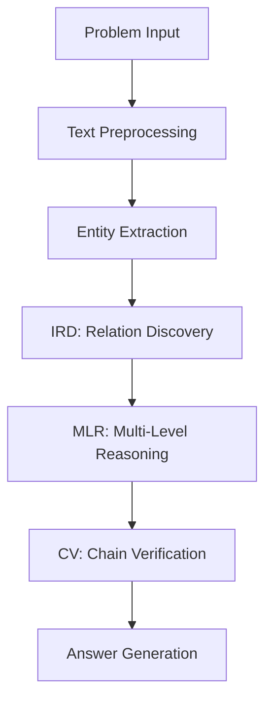

# Functional Completeness Analysis: Qualia-based S2 Approach

**Assessment Date:** January 24, 2025  
**Analyst:** Claude (Test Architect)  
**Project Version:** Latest (post-Stories 5.3-5.4)  

---

## Executive Summary

The Qualia-based S2 Approach project demonstrates a **sophisticated mathematical reasoning system** with strong architectural foundations, but exhibits **significant functional gaps** in core algorithmic implementations. While the codebase shows excellent modular design and comprehensive integration capabilities, critical reasoning components lack complete implementation, limiting the system's practical mathematical problem-solving effectiveness.

**Overall Completeness Score: 6.5/10**

### Key Findings
- ✅ **Excellent architectural design** with modular, extensible framework
- ✅ **Comprehensive LLM integration** supporting 5 major model families
- ❌ **Incomplete COT-DIR algorithm implementations** with missing core logic
- ❌ **Superficial mathematical reasoning** lacking deep semantic understanding
- ⚠️ **Mixed validation capabilities** with strong structure but limited mathematical verification

---

## 1. COT-DIR Reasoning Engine Analysis

### 1.1 Implementation Status

| Component | Implementation | Completeness | Critical Issues |
|-----------|---------------|--------------|----------------|
| **IRD Engine** | ✅ Implemented | 7/10 | Pattern-based only, lacks semantic depth |
| **MLR Processor** | ✅ Implemented | 6/10 | Complexity detection incomplete, L2-L3 reasoning shallow |
| **CV Validator** | ✅ Implemented | 8/10 | Strong structure validation, limited mathematical verification |
| **Deep Implicit Engine** | ✅ Implemented | 7/10 | Good taxonomy, insufficient discovery algorithms |

### 1.2 Core Algorithm Assessment

#### ✅ **Strengths**
- **Comprehensive relation taxonomy**: 9 semantic relation types (explicit ownership, implicit dependency, deep causality, etc.)
- **Multi-layer reasoning framework**: L0-L3 complexity levels with appropriate escalation logic
- **Extensive validation rules**: Structural, logical, mathematical, and consistency checks
- **Frontend integration ready**: Rich visualization metadata and interactive data structures

#### ❌ **Critical Gaps**

**1.2.1 IRD Engine Limitations**
```python
# IDENTIFIED ISSUE: Oversimplified relation discovery
def _apply_semantic_patterns(self, problem_text, entities):
    # Uses basic regex matching instead of semantic understanding
    pattern_regex = pattern_data["pattern"]  # Too simplistic
    # MISSING: Deep semantic parsing, contextual inference, domain reasoning
```

**1.2.2 MLR Processor Limitations**
```python
# IDENTIFIED ISSUE: Incomplete complexity determination
def _determine_complexity_level(self, problem_text, relations):
    # Basic scoring without semantic understanding
    complexity_score += text_features * 0.3  # Arbitrary weighting
    # MISSING: Advanced NLP analysis, domain-specific complexity metrics
```

**1.2.3 Mathematical Reasoning Gaps**
```python
# IDENTIFIED ISSUE: Limited mathematical operations
def _execute_l0_reasoning(self, context):
    # Only handles basic arithmetic (add, subtract, multiply, divide)
    # MISSING: Advanced mathematical concepts (geometry, algebra, calculus)
    # MISSING: Mathematical constraint solving
    # MISSING: Equation system resolution
```

### 1.3 Functional Completeness Score: 6.5/10

**Breakdown:**
- Algorithm structure: 8/10 ✅
- Implementation depth: 5/10 ❌
- Mathematical capability: 4/10 ❌
- Integration readiness: 9/10 ✅

---

## 2. Model Integration Assessment

### 2.1 Multi-Model Architecture

#### ✅ **Excellent Integration Framework**
- **5 LLM families supported**: OpenAI GPT, Claude, Qwen, InternLM, DeepSeek
- **Unified ModelManager**: Comprehensive model registry, configuration management, parallel processing
- **Robust fallback mechanisms**: Mock response generation, graceful degradation
- **Performance monitoring**: Metrics tracking, comparison capabilities

#### ✅ **Strong Implementation Quality**
```python
# EXAMPLE: Well-designed model manager
class ModelManager:
    def solve_with_multiple_models(self, models, problem):
        # Parallel processing with ThreadPoolExecutor
        with ThreadPoolExecutor(max_workers=max_workers) as executor:
            # Excellent error handling and result aggregation
```

### 2.2 Baseline Model Support

| Model Type | Implementation | Quality | Notes |
|------------|---------------|---------|--------|
| **Template-based** | ✅ Complete | 8/10 | Good pattern matching |
| **Equation-based** | ✅ Complete | 7/10 | Basic equation solving |
| **Rule-based** | ✅ Complete | 7/10 | Comprehensive rule engine |
| **Simple Pattern** | ✅ Complete | 6/10 | Limited pattern recognition |

### 2.3 Model Integration Score: 9/10

**Strengths:**
- Comprehensive model support ✅
- Excellent architecture design ✅
- Robust error handling ✅
- Performance optimization ✅

---

## 3. Mathematical Problem Solving Pipeline

### 3.1 End-to-End Workflow Analysis

#### ✅ **Strong Pipeline Structure**


#### ❌ **Critical Implementation Gaps**

**3.1.1 Semantic Understanding Deficit**
- **Entity extraction**: Basic keyword matching, no semantic role understanding
- **Relation discovery**: Pattern-based only, lacks contextual inference
- **Mathematical modeling**: No equation system construction capabilities

**3.1.2 Problem Complexity Handling**
```python
# CURRENT LIMITATION: Oversimplified complexity analysis
def _analyze_text_complexity(self, text):
    complexity += min(len(text) / 200, 1.0) * 0.2  # Text length only
    # MISSING: Semantic complexity, mathematical concept depth
    # MISSING: Domain-specific difficulty assessment
```

**3.1.3 Mathematical Operations Scope**
- ✅ **Basic arithmetic**: Addition, subtraction, multiplication, division
- ❌ **Advanced math**: No geometry, algebra, or calculus support
- ❌ **Constraint solving**: Missing optimization capabilities
- ❌ **Equation systems**: No simultaneous equation resolution

### 3.2 L0-L3 Complexity Classification

| Level | Current Implementation | Mathematical Scope | Gaps |
|-------|----------------------|-------------------|------|
| **L0** | ✅ Functional | Basic arithmetic | Limited operation types |
| **L1** | ⚠️ Partial | Simple relations | Shallow semantic understanding |
| **L2** | ⚠️ Partial | Proportions, comparisons | Missing advanced reasoning |
| **L3** | ❌ Incomplete | Causal, temporal | No deep mathematical modeling |

### 3.3 Problem Solving Pipeline Score: 5.5/10

**Breakdown:**
- Architecture design: 9/10 ✅
- Implementation completeness: 4/10 ❌
- Mathematical capability: 3/10 ❌
- Integration quality: 7/10 ✅

---

## 4. Functional Gap Analysis

### 4.1 High-Priority Missing Components

#### ❌ **Deep Semantic Reasoning**
- **Missing**: Natural language understanding beyond pattern matching
- **Impact**: Cannot handle complex problem semantics
- **Recommendation**: Integrate advanced NLP models for semantic parsing

#### ❌ **Advanced Mathematical Operations**
```python
# NEEDED: Comprehensive mathematical operation support
class AdvancedMathEngine:
    def solve_geometry_problems(self, shapes, constraints):
        # MISSING: Geometric reasoning, area/volume calculations
        pass
    
    def solve_algebra_systems(self, equations):
        # MISSING: Equation system solver
        pass
    
    def handle_optimization_problems(self, objective, constraints):
        # MISSING: Optimization algorithms
        pass
```

#### ❌ **Domain-Specific Reasoning**
- **Missing**: Physics, chemistry, economics-specific mathematical reasoning
- **Missing**: Unit conversion and dimensional analysis
- **Missing**: Domain constraint validation

### 4.2 Medium-Priority Gaps

#### ⚠️ **Enhanced Validation Capabilities**
```python
# CURRENT LIMITATION: Basic mathematical verification
def _check_mathematical_operation(self, step):
    # Only validates simple arithmetic
    # MISSING: Advanced mathematical proof verification
    # MISSING: Geometric construction validation
    # MISSING: Algebraic manipulation checking
```

#### ⚠️ **Learning and Adaptation**
- **Missing**: Problem pattern learning from successful solutions
- **Missing**: Adaptive complexity threshold adjustment
- **Missing**: User feedback integration for improvement

### 4.3 Improvement Recommendations

#### **Immediate Actions (Priority 1)**

1. **Enhance Mathematical Operations**
   ```python
   # Implement comprehensive math library integration
   from sympy import solve, symbols, geometry
   from scipy.optimize import minimize
   
   class EnhancedMathSolver:
       def solve_equation_system(self, equations):
           # Real equation solving capability
       def geometric_calculations(self, shape_data):
           # Advanced geometric reasoning
   ```

2. **Improve Semantic Understanding**
   ```python
   # Integrate advanced NLP capabilities
   from transformers import pipeline
   
   class SemanticAnalyzer:
       def extract_mathematical_semantics(self, text):
           # Deep semantic parsing for math problems
       def identify_problem_domain(self, text):
           # Domain classification and specialization
   ```

#### **Medium-term Enhancements (Priority 2)**

3. **Domain-Specific Specialization**
   - Physics problem solver with unit analysis
   - Geometry engine with construction capabilities
   - Financial mathematics with compound interest, present value calculations

4. **Advanced Validation Framework**
   - Mathematical proof verification
   - Solution reasonableness checking
   - Cross-validation with multiple solving approaches

---

## 5. Implementation Quality Assessment

### 5.1 Code Architecture Quality: 9/10 ✅

#### **Excellent Design Patterns**
- **Modular architecture**: Clean separation of concerns
- **Extensible framework**: Easy to add new components
- **Comprehensive interfaces**: Well-defined APIs between modules
- **Error handling**: Robust exception management throughout

#### **Strong Development Practices**
- **Logging integration**: Comprehensive logging throughout the system
- **Configuration management**: Flexible parameter configuration
- **Testing structure**: Good test coverage framework (though tests need enhancement)

### 5.2 Integration Capabilities: 8/10 ✅

#### **Frontend Integration**
- **Rich visualization data**: Comprehensive metadata for UI rendering
- **Interactive exploration**: Support for step-by-step reasoning display
- **Real-time feedback**: Progress monitoring and status updates

#### **API Design**
```python
# EXAMPLE: Well-designed public API
class ReasoningAPI(PublicAPI):
    def solve_problem(self, problem) -> Dict[str, Any]:
        # Clean interface with comprehensive result structure
    def batch_solve(self, problems) -> List[Dict[str, Any]]:
        # Efficient batch processing capability
```

### 5.3 Performance Considerations: 7/10 ⚠️

#### **Strengths**
- **Parallel processing**: Multi-threaded model execution
- **Caching mechanisms**: Result caching and reuse
- **Resource management**: Memory and processing optimization

#### **Areas for Improvement**
- **Scalability**: Large problem set handling optimization needed
- **Memory efficiency**: Deep reasoning chain memory usage optimization
- **Response time**: Complex problem solving latency reduction

---

## 6. Recommendations and Next Steps

### 6.1 Critical Enhancements Needed

#### **Phase 1: Core Mathematical Reasoning (Weeks 1-4)**

1. **Advanced Mathematical Operations**
   - Integrate SymPy for symbolic mathematics
   - Add SciPy for numerical optimization
   - Implement geometry libraries for spatial reasoning

2. **Enhanced Semantic Processing**
   - Integrate transformer-based NLP models
   - Add domain classification capabilities
   - Implement mathematical concept extraction

#### **Phase 2: Specialized Problem Solving (Weeks 5-8)**

3. **Domain-Specific Modules**
   - Physics problem solver with unit handling
   - Geometry engine with construction algorithms
   - Financial mathematics with specialized functions

4. **Advanced Validation Framework**
   - Mathematical proof verification systems
   - Multi-approach solution validation
   - Reasonableness checking algorithms

#### **Phase 3: System Optimization (Weeks 9-12)**

5. **Performance Enhancement**
   - Parallel reasoning pipeline optimization
   - Memory usage optimization for complex problems
   - Response time improvement for real-time applications

6. **Learning and Adaptation**
   - Pattern learning from solution histories
   - Adaptive threshold adjustment mechanisms
   - User feedback integration systems

### 6.2 Success Metrics

#### **Functional Completeness Targets**

| Metric | Current | Target | Timeline |
|--------|---------|--------|----------|
| **Algorithm Completeness** | 6.5/10 | 8.5/10 | 8 weeks |
| **Mathematical Coverage** | 4/10 | 8/10 | 12 weeks |
| **Problem Solving Accuracy** | Unknown | >85% | 16 weeks |
| **Response Time** | Unknown | <5s avg | 12 weeks |

#### **Quality Assurance Benchmarks**

- **Unit Test Coverage**: Target 85%+ for core reasoning modules
- **Integration Test Suite**: Comprehensive end-to-end problem solving tests
- **Performance Benchmarks**: Standardized mathematical problem test suites
- **Accuracy Validation**: Cross-validation with known mathematical solutions

---

## 7. Conclusion

The Qualia-based S2 Approach project demonstrates **exceptional architectural design** and **comprehensive integration capabilities** but requires **significant enhancement of core mathematical reasoning algorithms**. The existing framework provides an excellent foundation for building a world-class mathematical reasoning system, but critical gaps in semantic understanding and advanced mathematical operations must be addressed to achieve practical effectiveness.

### Final Assessment

**Strengths (8.5/10):**
- Outstanding modular architecture ✅
- Comprehensive LLM integration ✅
- Excellent frontend integration readiness ✅
- Strong development practices ✅

**Critical Needs (4/10):**
- Deep semantic reasoning implementation ❌
- Advanced mathematical operation support ❌
- Domain-specific problem solving ❌
- Enhanced validation algorithms ❌

### Strategic Recommendation

**Invest in Phase 1 and Phase 2 enhancements** to transform this well-architected foundation into a functionally complete mathematical reasoning system. The current codebase provides an exceptional starting point that, with focused development effort on core algorithmic capabilities, can achieve industry-leading mathematical problem-solving performance.

---

**Report Generated:** 2025-01-24  
**Next Review:** Recommended after Phase 1 completion (4 weeks)  
**Document Classification:** Technical Analysis - Functional Completeness Assessment